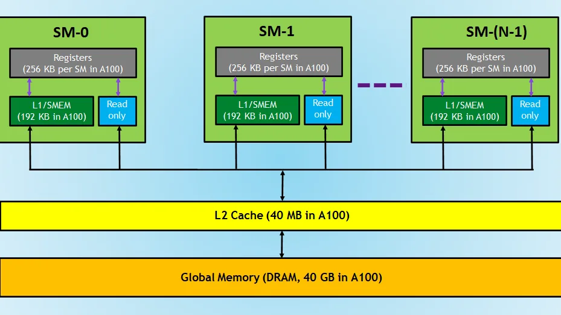

# Learning CUDA Reduction

This is a living learning note. 

I am writing down what I understand as I go:
first correctness, then performance. Each level is a slightly different answer
to the same question: once many threads have partial sums, where should those
sums meet?

This is made possible with the hardware support from the [UCCL project](https://github.com/uccl-project). We are going to start with challenges based on [LeetGPU](https://leetgpu.com/challenges).


Notes I still want to add:
- Benchmark each version with the same input size and hardware.
- Add occupancy / memory bandwidth notes instead of only code structure.
- Revisit Hopper thread block clusters and make the DSMEM version compile cleanly.
- Compare atomic-based, multi-pass, and cluster-based reductions.

Reduction

Write a GPU program that performs parallel reduction on an array of 32-bit floating point numbers to compute their sum. The program should take an input array and produce a single output value containing the sum of all elements.(copied from LeetGPU)

What is reduction?
a parallel algorithm that recursively applies an associative and commutative binary operator (such as addition, minimum, or maximum) to an array of numbers to produce a single, aggregate value. In this case, we are reducing an array of N elements into one.

if we are coding in CPU, it would be intuitive to write something like:
```
float sum = 0.0f;

for (int i = 0; i < N; i++) {
    sum += array[i];
}

return sum;
```

But since we are in CUDA, we need to think in terms of threads. We want to express
in what EACH thread has to do. In this case, it is just addition.


### Level 0: global atomicAdd per element

With some intuition, we can easily create something like this:

```
__global__ void reduction(const float* input, float* output, int N){
    int i = blockIdx.x * blockDim.x + threadIdx.x;

    if (i < N) {
        atomicAdd(output, input[i]);
    }
}

// input, output are device pointers
extern "C" void solve(const float* input, float* output, int N) {
    // initialize things the simplest way possible here
    int threadsPerBlock = 256;
    int blocksPerGrid = (N + threadsPerBlock - 1) / threadsPerBlock;
    cudaMemset(output, 0, sizeof(float));

    reduction<<<blocksPerGrid, threadsPerBlock>>>(input, output, N);
    cudaDeviceSynchronize();
}
```
It is correct. But does way too many atomicAdd()!

### Interlude 0: Why is atomicAdd() bad in CUDA?

It is not "bad" because it is incorrect. It is bad here because every thread is
trying to update the same address, `output[0]`. The hardware has to serialize
those updates enough to avoid lost writes. So even though I launched many
threads, the final accumulation becomes a long line of threads waiting to touch
one memory location.

The part I used to take for granted is the difference between `+` and
`atomicAdd()`.

When I write this:

```
sum += input[i];
```

the meaning depends entirely on where `sum` lives.

If `sum` is a local variable inside one thread, then `sum += input[i]` is just
normal arithmetic on that thread's private register. No other thread can see or
modify that register.

But if many threads all do this:

```
output[0] += input[i];
```

then this is a read-modify-write race:

```
old = output[0]
new = old + input[i]
output[0] = new
```

Two threads can read the same old value, compute two different new values, and
then one write can overwrite the other. `atomicAdd()` fixes correctness by
making that read-modify-write update indivisible for that memory location.

The tradeoff is performance. Correctness is rescued by forcing order at a hot
address. That is exactly the bottleneck I am trying to remove in later levels.

This version is still useful as Level 0 because it gives me a correct baseline:
one global load per element, one global atomic per element, and very little code.
The next levels are mostly attempts to reduce the number of global atomics.

TBD: I still want to quantify how expensive global
floating-point atomics are on B300/GH200. The intuition is clear, but the post
needs numbers.

### Interlude 1: difference between cudaDeviceSynchronize() and __syncthreads()

cudaDeviceSynchronize() is called from the CPU / host side.

It means: CPU waits until previously launched GPU work is finished.

Example mental flow:

CPU launches kernel

GPU starts running kernel asynchronously

CPU would normally continue immediately

cudaDeviceSynchronize()

CPU waits here until GPU kernel is done

So ```cudaDeviceSynchronize(); ``` is a host-side global wait.

__syncthreads()

This is called from inside a CUDA kernel, so from the GPU side.

It means: all threads inside the same block wait for each other

Very important: only threads in the same block synchronize. It does not synchronize different blocks. Inter-block synchronization is possible, but it is not what plain `__syncthreads()` does. The simple ways to create a grid-wide ordering point are to launch another kernel, use a cooperative-groups grid sync, or use newer cluster-level synchronization when the hardware and launch mode support it.

```__syncthreads(); ```is a within-one-block barrier.

We use it when threads in the same block share data through shared memory.


### Interlude 2: how to calculate blocksPerGrid?
Our ultimate goal is to make sure at least one thread is taking care of one
element in the array. So for an array of `N` elements, we should spawn **at
least** `N` threads. Here, the number of threads per block is defined by
`threadsPerBlock`. So naively, we have:

```
blocksPerGrid = N / threadsPerBlock
```

However, we need to also handle integer division. To make sure
`threadsPerBlock * blocksPerGrid >= N`, this is what we want:

```
blocksPerGrid = (N + threadsPerBlock - 1) / threadsPerBlock
```

Measurement note to add later: keep `N` fixed and sweep `threadsPerBlock` over
128, 256, 512, and 1024. The number of blocks changes, but so do occupancy,
shared-memory use, and scheduling overhead.

### Level 1: shared-memory block reduction + one atomicAdd per block
Based on the naive version, we can ask ourselves: why can't we utilize the
parallelism between threads?

Assume an array of element N = 512. Also assume threadsPerBlock = 256;
easily, we get blocksPerGrid = 512/ 256 = 2 blocks

Can we collect the partial sums inside each block and do one `atomicAdd()` only
after a block finishes its local work?

Diagram note to add later: draw two blocks, each producing one block sum. The
important visual is that `N` element-wise atomics become `blocksPerGrid`
block-wise atomics.

conceptually, we want this to happen:

```
load input into shared
sync

stride = 128
round 1: tid 0..127 work
sync

stride = 64
round 2: tid 0..63 work
sync

stride = 32
round 3: tid 0..31 work
sync

...

stride = 1
round last: tid 0 works
sync

tid 0 adds shared[0] to output[0]
```

Something notable here is that the index i(defined as blockIdx.x + blockDim.x + threadIdx.x) is the **global index**

If we want a **local index**(within a block), we need to define a new variable called tid = threadIdx.x to differentiate from the global index


### Interlude 2: ```__shared__``` keyword

We need to have some very basic understanding of the memory hierarchy of GPU



Without any specification, we are loading and storing from the Global Memory.
The problem with is: it takes a long time to fetch the data and back. 

Intuitively, if we are going to work on a chunk of consecutive data, it is better
we load it into shared memory first(or L2 cache) and do the computation. Then store the desired output back. Here, the ```__shared__``` keyword is used to denotes the location of the data. 

Here, we are doing something in that sense. 

1. each thread loads input[i] into shared[threadIdx.x]
2. synchronize
3. repeatedly halve stride:
       if threadIdx.x < stride:
           shared[threadIdx.x] += shared[threadIdx.x + stride]
       synchronize
4. thread 0 has the block sum
5. thread 0 contributes block sum to final output


```
__global__ void reduction(const float* input, float* output, int N){
    // global i index
    int i = blockIdx.x * blockDim.x + threadIdx.x;
    // within a block, which thread I am 
    int tid = threadIdx.x;
    int stride =  blockDim.x / 2;
    __shared__ float shared[256]; // every thread in one block gets a piece

    // load the data in
    if (i < N) {
        shared[tid] = input[i];
    }
    else {
        shared[tid] = 0;
    }
    // Always remember to sync!
    __syncthreads();

    // reduction
    while (stride > 0) {
        if(tid < stride) {
            shared[tid] += shared[tid + stride];
        }
        __syncthreads();
        stride = stride / 2;
    }

    // now that the data is aggregated
    // we 
    if (tid == 0) {
    // copy into output
    atomicAdd(output, shared[tid]);
    }
}
```

Measurement note to add later: compare this against Level 0. The expected change
is fewer atomics, but more shared-memory traffic and more block-local barriers.

### Level 2: warp shuffle reduction inside each warp and warp reductions + CTA reduction over warp sums


What is a warp?
A warp is the group of 32 CUDA threads that the GPU schedules together. I like
to think of it as the smallest "walking together" unit inside a block: each
thread still has its own registers and its own lane id, but warp-level
instructions let the lanes exchange values directly.


Mental mode:
1. thread loads input[i] into local val

2. warp-level reduction:
       val lives in registers
       lanes exchange values using __shfl_down_sync
       no shared memory
       no __syncthreads()

3. lane 0 writes warp sum to shared[warp_id]

4. __syncthreads()

5. warp 0 reduces shared[0..num_warps-1]


Now, what does FULL_MASK mean?

```0xffffffff``` is a 32-bit mask where all 32 bits are 1. 
It means: all 32 lanes in this warp participate

So ```__shfl_down_sync(FULL_MASK, val, stride)``` says: among these 32 participating lanes, move each lane’s val downward by stride.

After the warp reduction, we use:
```
if (lane_id == 0) {
    // this thread has the warp sum
}
```
Then lane 0 of each warp can write its warp sum to shared memory:
```
shared[warp_id] = val
```
Then we use ```__syncthreads()``` once, because now we are crossing warp boundaries.

The structure is:
```
thread loads input[i] into val

warp-level:
    reduce val inside warp using shfl
    no shared memory
    no __syncthreads()

lane 0:
    writes warp sum into shared[warp_id]

__syncthreads()

warp 0:
    reduces the warp sums

FULL_MASK, offset, and how to use __shfl_down_sync()

no need to synchronize between warp levels
```


```
#include <cuda_runtime.h>

#define FULL_MASK 0xffffffff

__global__ void reduction(const float* input, float* output, int N){
    int i = blockIdx.x * blockDim.x + threadIdx.x;
    float val = 0.0f;
    __shared__ float warp_sums[8];  // 8 = 256 / 32

    // warp is like mini blocks  1 warp = 32 threads
    int stride = 32 / 2;
    // similarly, like thread id, i also need "warp id"
    int lane_id = threadIdx.x % 32; // within a warp, where am i
    int warp_id = threadIdx.x / 32; // within a block, which warp

    // load data just like before, but this time not into shared
    // memory but register
    if (i < N) {
        val = input[i];
    }
    else {
        val = 0.0f;
    }

    while(stride > 0) {
        // read val from the lane offset positions below me, then add it to my val
        val += __shfl_down_sync(FULL_MASK, val, stride);
        stride = stride / 2;
    }

    if (lane_id == 0) {
        warp_sums[warp_id] = val;
    }

    __syncthreads();

    // now we have this tiny array of
    // warp_sums = [s0, s1, s2, s3, s4, s5, s6, s7]
    // we need to perform reduction again

    if (warp_id == 0) {
        if (lane_id == 0) {
            val = warp_sums[0];
        }
        else if (lane_id == 1) {
            val = warp_sums[1];
        }
        else if (lane_id == 2) {
            val = warp_sums[2];
        }
        else if (lane_id == 3) {
            val = warp_sums[3];
        }
        else if (lane_id == 4) {
            val = warp_sums[4];
        }
        else if (lane_id == 5) {
            val = warp_sums[5];
        }
        else if (lane_id == 6) {
            val = warp_sums[6];
        }
        else if (lane_id == 7) {
            val = warp_sums[7];
        }
        else {
            val = 0.0f;
        }
        val += __shfl_down_sync(FULL_MASK, val, 4);
        val += __shfl_down_sync(FULL_MASK, val, 2);
        val += __shfl_down_sync(FULL_MASK, val, 1);

        if (lane_id == 0) {
            atomicAdd(output, val);
        }
    }
}
```

Obviously, to make the code looks cleaner, we can rewrite the last part into 

```
if (warp_id == 0) {
    val = (lane_id < 8) ? warp_sums[lane_id] : 0.0f;

    // do the same shuffle reduction on val again:
    // offset = 16, 8, 4, 2, 1
    // val += shfl_down(val, offset)

    if (lane_id == 0) {
        atomicAdd(output, val);
    }
}
```

Measurement note to add later: this version should reduce shared-memory use and
barrier count compared with Level 1. The useful benchmark is not just runtime,
but also whether memory bandwidth improves when the partial sums stay in
registers for longer.

### Level 3: multi-pass reduction without atomics

The last remaining global atomic is the one at the end of each block. Instead
of having every block update `output[0]`, each block can write exactly one
partial sum into a temporary array. Then a second kernel reduces those partials.

This turns the kernel launch itself into a global synchronization boundary:
kernel 2 cannot start until kernel 1 has finished writing all partial sums.

The important part is that Level 3 is not a new reduction strategy. It is Level
2 with the final write changed.

Here is the kernel-level diff:

```diff
- __global__ void reduction(const float* input, float* output, int N) {
+ __global__ void reduce_to_partials(const float* input, float* partials, int N) {
      ...
      if (warp_id == 0) {
          val = (lane_id < WARPS_PER_BLOCK) ? warp_sums[lane_id] : 0.0f;

          val += __shfl_down_sync(FULL_MASK, val, 4);
          val += __shfl_down_sync(FULL_MASK, val, 2);
          val += __shfl_down_sync(FULL_MASK, val, 1);

          if (lane_id == 0) {
-             atomicAdd(output, val);
+             partials[blockIdx.x] = val;
          }
      }
  }
```

So the only conceptual change inside this kernel is:

```
one block atomically contributes to final output
```

becomes:

```
one block writes one private partial sum
```


one last bit: notice that Level 2 still used `atomicAdd()` at the very end?

For now, we are doing warp_id = 0, lane_id = 0 adding into output

but what if there are lots of blocks?
again, contention.

```
block 0 atomicAdds block_sum_0 into output[0]
block 1 atomicAdds block_sum_1 into output[0]
block 2 atomicAdds block_sum_2 into output[0]
...
```

So how to resolve this last bit of contention?

The version below captures the idea, but the final pass needs special care
when the partials array is still larger than one block can reduce.

```diff
 #define THREADS_PER_BLOCK 256
 #define WARPS_PER_BLOCK 8

-__global__ void reduction(const float* input, float* output, int N) {
-    int i = blockIdx.x * blockDim.x + threadIdx.x;
+__global__ void reduce_to_partials(const float* input, float* partials, int N) {
+    int global_i = blockIdx.x * blockDim.x + threadIdx.x;

     float val = 0.0f;

     int lane_id = threadIdx.x % 32;
     int warp_id = threadIdx.x / 32;

     __shared__ float warp_sums[WARPS_PER_BLOCK];

-    if (i < N) {
-        val = input[i];
+    if (global_i < N) {
+        val = input[global_i];
     } else {
         val = 0.0f;
     }

     // First stage: reduce inside each warp.
     val += __shfl_down_sync(FULL_MASK, val, 16);
     val += __shfl_down_sync(FULL_MASK, val, 8);
     val += __shfl_down_sync(FULL_MASK, val, 4);
     val += __shfl_down_sync(FULL_MASK, val, 2);
     val += __shfl_down_sync(FULL_MASK, val, 1);

     // Lane 0 of each warp writes one warp sum.
     if (lane_id == 0) {
         warp_sums[warp_id] = val;
     }

     __syncthreads();

     // Second stage: warp 0 reduces the 8 warp sums.
     if (warp_id == 0) {
         if (lane_id < WARPS_PER_BLOCK) {
             val = warp_sums[lane_id];
         } else {
             val = 0.0f;
         }

         // Reduce 8 values: offsets 4, 2, 1.
         val += __shfl_down_sync(FULL_MASK, val, 4);
         val += __shfl_down_sync(FULL_MASK, val, 2);
         val += __shfl_down_sync(FULL_MASK, val, 1);

-        // One block atomically contributes to final output.
+        // One block writes one partial sum.
         if (lane_id == 0) {
-            atomicAdd(output, val);
+            partials[blockIdx.x] = val;
         }
     }
 }
```

TBD: the second-pass kernel is intentionally omitted
here because I want to first make the kernel-level transformation clear. The
full multi-pass version needs a loop on the host side or a repeated kernel
launch pattern until `num_partials == 1`.

### Level 4: H100 and B200 specific hardware optimizations (WIP)

## 4a: H100 related concepts and Hardware optimization

Hopper Architecture introduced the Thread Block Cluster concept.

It is introduced via ```cudaLaunchKernelEx```. It allows shared memory access across blocks within a cluster — called Distributed Shared Memory (DSMEM)

This is big for reduction: we can reduce across blocks without atomics or a second kernel launch, because blocks in the same cluster can directly read each other's shared memory

Note: Cluster size up to 8 blocks on H100

Old pipeline:
256 threads -> warp reduce -> shared mem -> block sum -> atomicAdd to global

New pipeline:
256 threads -> warp reduce -> shared mem -> block sum → DSMEM -> cluster reduce -> atomicAdd to global

The warp-level reduction code is untouched. The changes are all about what happens after each block has its partial sum.

3 things on our TODO List:
1. Kernel launch — use clusters
Instead of ```<<<blocksPerGrid, threadsPerBlock>>>```, we need ```cudaLaunchKernelEx``` with a cluster size specified. This is the new API.

2. Declare cluster in kernel — new annotations
```
__cluster_dims__(8, 1, 1)  // 8 blocks per cluster
__global__ void reduction(...)
```

or, 

dynamically via launch config. Each block now knows its ```cluster_id``` and ```block_rank_in_cluster```.

3. Replace ```atomicAdd``` with DSMEM reduction across the cluster
Instead of every block doing ```atomicAdd(output, block_sum)```, blocks within a cluster can now write their block_sum into their own shared memory. Other blocks in the cluster directly read that shared memory via ```cluster.map_shared_rank(ptr, rank)```
One elected block (rank 0) reduces all 8 partial sums and does a single ```atomicAdd```

This means if we have 1024 blocks and cluster size 8, you go from 1024 atomics to 128 atomics — one per cluster.

The conceptual shift
Before, shared memory was block-private. On H100 with clusters, shared memory is cluster-visible. So any block in the cluster can read any other block's shared memory directly. This is the hardware change that makes it possible.

New primitives to get comfortable:

```
// include the necessary header
#include <cooperative_groups.h>
namespace cg = cooperative_groups;

// inside kernel
cg::cluster_group cluster = cg::this_cluster();
cluster.sync();                          // like __syncthreads() but across blocks
cluster.map_shared_rank(ptr, rank);      // get pointer into another block's smem
cluster.block_rank();                    // which block am I in the cluster (0-7)
```


```
#include <cuda_runtime.h>
#include <cooperative_groups.h>

#define FULL_MASK 0xffffffff
#define THREADSPERBLOCK 256

namespace cg = cooperative_groups;
__cluster_dims__(8,1,1)

__global__ void reduction(const float* input, float* output, int N) {
    int i = blockIdx.x * blockDim.x + threadIdx.x;
    int lane_id = threadIdx.x % 32; // which thread inside a warp
    int warp_id = threadIdx.x / 32; // which warp

    float val = 0.0f; // living in the register

    // load data
    if (i < N) {
        val = input[i];
    }
    // do i need to sync here? no right? why not?
    // No, because every thread is loading into its own register(private memory)
    // nothing to be synced

    // start reduction
    int stride = 32 / 2;
    while(stride > 0){
        val += __shfl_down_sync(FULL_MASK, val, stride);
        stride = stride / 2;
    }
    // do i need to __syncwarp() here?
    // no, __shfl_down_sync() already has that baked in

    // now that we have lane 0 of warp 0 (partial sum of thread 0 to 31)
    // warp 1 (partial sum of thread 32 to 63)
    // warp 2 (partial sum of thread 64 to 95) ...
    // need to reduce them
    __shared__ float buffer[8]; // THREADSPERBLOCK/ 32
    int tid =  threadIdx.x;

    // load the date into shared memory
    if (lane_id == 0) {
        buffer[warp_id] = val;
    }
    __syncthreads();

        // reduce the 8 warp sums inside the block
    float block_sum = 0.0f;

    if (warp_id == 0) {
        block_sum = (lane_id < 8) ? buffer[lane_id] : 0.0f;

        for (int stride = 16; stride > 0; stride /= 2) {
            block_sum += __shfl_down_sync(FULL_MASK, block_sum, stride);
        }

        if (lane_id == 0) {
            buffer[0] = block_sum;  // now buffer[0] is the whole block sum
        }
    }

    __syncthreads();

    cg::cluster_group cluster = cg::this_cluster();
    // after __syncthreads(), outside the warp_id == 0 guard
    cluster.sync(); // wait for all 8 blocks to finish writing to their shared buffer

    if (tid == 0) { // only one thread per block needs to do this
        float cluster_sum = 0.0f;
        int cluster_size = cluster.num_blocks();
        for (int rank = 0; rank < cluster_size; rank++) {
            float* remote_buffer = cluster.map_shared_rank(buffer, rank);
            cluster_sum += remote_buffer[0];
        }
        // only block 0 of the cluster does the final atomicAdd
        if (cluster.block_rank() == 0) {
            atomicAdd(output, cluster_sum);
        }
    }

    cluster.sync();
}

// We have revamped the host side entirely
// therefore, not doing code diff here
extern "C" void solve(const float* input, float* output, int N) {
    int threadsPerBlock = THREADSPERBLOCK;
    int blocksPerGrid = (N + threadsPerBlock - 1) / threadsPerBlock;
    if (blocksPerGrid == 0) blocksPerGrid = 8;
    blocksPerGrid = ((blocksPerGrid + 7) / 8) * 8;

    // output must be zeroed by caller; if not, do it here:
    cudaMemsetAsync(output, 0, sizeof(float));

    cudaLaunchConfig_t config = {};
    config.gridDim  = blocksPerGrid;
    config.blockDim = threadsPerBlock;
    config.attrs    = nullptr;   // cluster dim comes from __cluster_dims__
    config.numAttrs = 0;

    cudaLaunchKernelEx(&config, reduction, input, output, N);
}
```

Measurement note to add later: only keep this section if the cluster version
compiles and passes correctness tests. Otherwise, this should stay as a future
optimization note rather than a claimed implementation.

Blackwell

Future note: I need to separate what is actually relevant to reduction from
what is relevant to matrix multiplication. Tensor-core features are probably
not the main story for a scalar sum. For reduction, the more relevant Blackwell
questions are memory bandwidth, atomic throughput, launch overhead, and whether
cluster-level reductions behave differently from Hopper.

Further Readings:
https://ieeexplore.ieee.org/stamp/stamp.jsp?tp=&arnumber=10938416
https://research.colfax-intl.com/cutlass-tutorial-gemm-with-thread-block-clusters-on-nvidia-blackwell-gpus/


### References

https://developer.nvidia.com/blog/cuda-refresher-cuda-programming-model/
https://developer.nvidia.com/blog/using-cuda-warp-level-primitives/
https://docs.nvidia.com/cuda/cuda-programming-guide/04-special-topics/cooperative-groups.html
